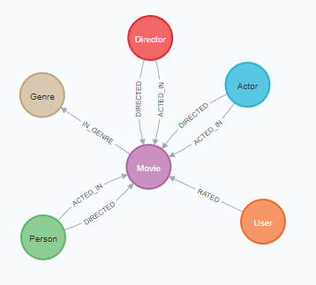

# Specialication Project 2022/2023 - Graph Neural Networks driven Recommender Systems

The goal of this project was to build a solid recommender system opon the MovieLens 100K dataset. The data has been taken from [Neo4J's sandbox project 'Recommendation'](https://sandbox.neo4j.com/). The preprocessed data is stored in `./data`

A detailed report about the project can be found in ./artefacts/TechnicalReport_VP1_RecommenderSystem_RomanLoop.pdf

## Python environment setup

Apart from `PyTorch Geometric` all libraries can be installed with `pip`. Code snippets to install PyTorch Geometric can be found in `00_Install_PyTorchGeom.ipynb`.

