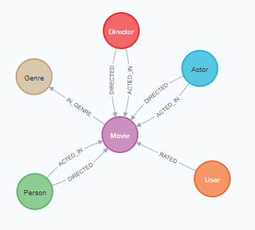
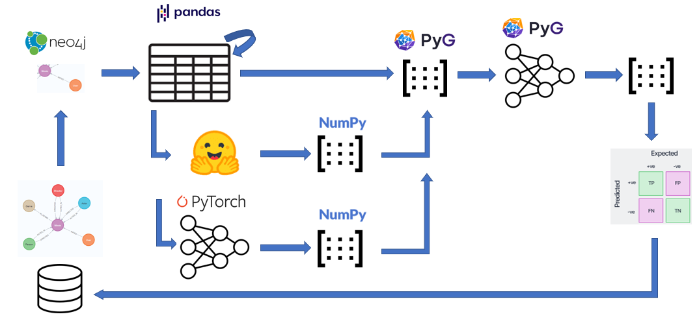

# Specialication Project 2022/2023 - Graph Neural Networks driven Recommender Systems

### Introduction

Recommender systems are the secret ingredient behind personalized online experiences and powerful decision-support tools in retail, entertainment, healthcare, finance, and other industries.

Recommender systems work by understanding the preferences, previous decisions, and other characteristics of many people. For example, recommenders can predict the types of movies an individual will enjoy based on the movies they’ve previously watched.

The three key objects managed by recommender systems are users, items and user-item interactions. These objects are tightly connected with each other and influence each other via various relations. For this very reason, recommender systems can be most naturally modelled by means of graphs through which the complex and heterogeneous nature of the available amount of information and data can be captured. It is therefore not surprising that in recent years the integration of graphs into recommender systems has attracted considerable attention from researchers and practitioners.

In a graph, the nodes correspond to entities (users and items), and edges correspond to relations between entities. Entities and their attributes can be mapped into a graph to understand the mutual relations between them.

As a graph learning technique Graph Neural Networks (GNN) will be applied. GNNs have recently be-come very popular due to their ability to learn complex systems of relations or interactions arising in a broad spectrum of problems. They have proven to be among the best performing architectures for a variety of graph learning tasks. The key idea in GNNs is to learn how to iteratively aggregate feature information from local graph neighborhoods using neural networks. This aggregation step allows each node to learn a more general node representation from its local neighborhood.

### Project goals and scope

The goal of this project was to build a recommender system opon the MovieLens 100K dataset to predict how a user would rate a certain movie. The data has been taken from [Neo4J's sandbox project 'Recommendation'](https://sandbox.neo4j.com/). This is a enriched dataset with many useful movie features. A preprocessed version of this dataset is stored in `./data`

### Documentation
A detailed report about the project as well as the presantation slides can be found in `./docs`

In this project I worked with a tech stack including: 
- Neo4j as database (raw data)
- Hugging face to embed movie titles an plots
- PyTorch and PyTorch Geometric (PyG) to build and train a GNN based recommender system
- Python data science stack (pandas, numpy etc.) for data processing

## Python environment setup

Apart from `PyTorch Geometric` all libraries can be installed with `pip`. I recommend to create a virtual environment with Python 3.9. The `requirements.txt` can be found in the project directory. Code snippets to install PyTorch Geometric can be found in `00_Install_PyTorchGeom.ipynb`.

### Conclusions and improvement
It was a very interesting project. I learned a lot about Graph Neural Networks and Recommender Systems. Although, the model performed very well, there are some points I think could be improved:
- Normalize user ratings: Some users tend to rate movies higher than others. The ratings should be normalized for each users, so that each user has the same mean rating.
- Lower k: For precision and recall at k. I used k=20, which is too high and leads to wrong conclusions. On average there are less than 20 samples of ratings above 3.5 for each user in the testset. Therefore, precision@20 is misleading. For a more accurate precision@k score, k should be lowerd to 5.
- My Recommender system does not consider cold starts: With the dataset used in this project I did not have the problem of *cold starts*. Cold start is a well known problem with recommender systems. I describes the problem that, a recommender system would never recommend a newly released movie to an user because there was simply no interaction with this movie during training. There are different ways to handle the problem of cold start. One is *binning* - the recommender systems does not recommend items but rather bins of items. A postprocessing step (e.g. business rule) than extracts a single item from the recommended bin to the user. Binning leads also to a reduction of the item space, which could be beneficial if the item space is very large.
